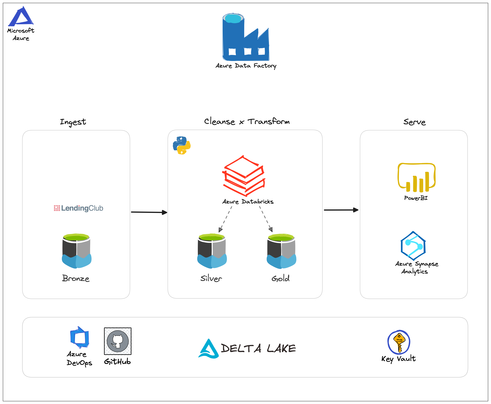
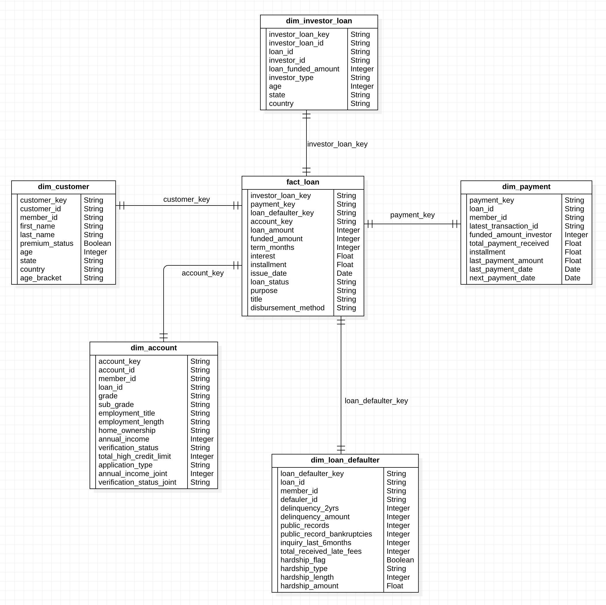

Note: If you are looking for the data dictionary and data processing documentation, you can refer to the following links:
- [Data Processing Docs](https://github.com/1byte-yoda/lending-club-analytics/blob/develop/data_transformations.md)
- [Data Dictionary](https://github.com/1byte-yoda/lending-club-analytics/blob/develop/data_dictionary.md)

### Problem Statement
- Data Engineering team from pee-to-peer lending platform called Lending Club who are interested in getting insights from their peer-to-peer platform
customers data, calculating credit score and customers loan availing patterns which helps them to knock out the blockers hindering their business and adding more trusted customers into their
platform to grow the business.
- Credit score and loan defaulters history becomes critical for investors to decide on the righteousness of a borrower
  availing for a personal loan through the platform who can pay back the borrowed money on time. Analyzing the data belonging to lenders and borrowers
  can bring in high value to the platform on ways to improvise their existing business.
- The huge volume of data generated on a daily basis is converted into a form which is readily consumed by analyst
  and data scientists for deepend analysis and processing by making use of big data stack to ingest, clean, and transform the data.

### Lending Club Background
- Financial Services Firm HeadQuartered in San Francisco, California
- A peer-to-peer lending firm for personal loans
- It connects the borrowers having good credit score, payment records and established financial histories with
  potential lenders.
- They have a grading system for every borrower based on their credit score and income data which will help out the investors to make up
  the decision to lend their money or not.
- Typical Interest Rates can range from 6% to 36% which can spread across a repayment schedule of 36-60 months

### Architecture

- The data source will be scraped from [lending club's website](https://www.lendingclub.com/info/download-data.action) using Python Azure Function and then stage the data to ADLS Gen2 Bronze Layer.
- The data will be processed / cleansed using Azure Databricks and will be stored under the ADLS Gen2 silver layer
- After the data has been processed and cleansed, it will be transformed to answer business related questions. The transformed data will be stored in ADLS Gen2 Gold Layer
- The gold data will be validated in-transit (separate pipeline job).
- Synapse analytics will serve as the serving layer and have a connection to the ADLS Gen2 Gold Layer and will create managed tables corresponding to each transformed file.
- The created table in Synapse Analytics will be presented using Power BI.
- The whole process will be orchestrated in Azure Data Factory and will execute on a daily basis.
- The pipeline can be monitored using Logs Analytics and Azure Monitor.

### Data Loading Strategy
- The data will be overwritten to the silver and gold layer.
- The data in the silver and gold layer will be stored in delta file format to support schema evolution, and for a simpler incremental data loading implementation.
- The data will be partitioned using the year_month and customer_state fields for optimal aggregation (as per the business questions / requirements)

### CI/CD
- Databricks Transformations and Processing will be tested using Pytest and will run as part of Azure Devops pipeline.
- Pyspark scripts will undergo a flake8 linter and will be auto-formatted using black 

### Star Schema Diagram

### Future Improvements
- Productionize Synapse and ADF in the CI/CD configuration
- Impose Data Governance and Security
  - Data lineage - to easily track data movement and be able to reproduce data issues within the downstream processes.
  - Data Masking for PII data (ie. age, annual income, public derogatory records, home ownership etc.)
  - Role Based Access Control - ie. Data Analyst can have access to silver and gold layer while the Management team will only have access to the gold layer
  - Row Level Security - for instance, only loans and borrowers that are assigned into an investor are visible to them
  - Column Level Security - here, anything that is irrelevant to the data user will be prohibited to him from accessing / querying.
- Upgrade the data loading strategy to incremental loading.
  - Currently, each table in the data warehouse contains a surrogate key for SCD readiness too.
- Setup Pipeline Alerts and Infrastructure Monitoring in Azure Log Analytics
- Increase test coverage of the code.
- Add Python Linters to test for low-hanging fruit errors
- Add Code Beautifier like Black to standardize code format
 